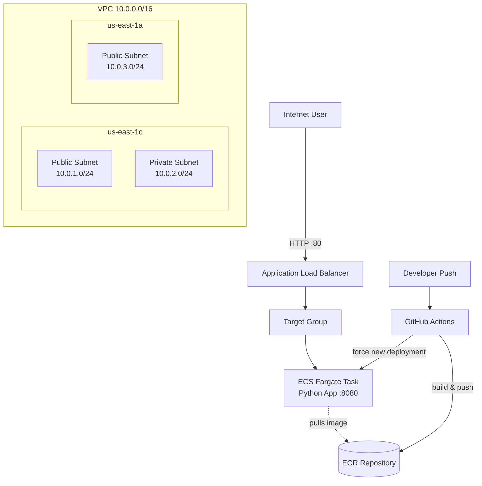

Automated AWS deployment pipeline using Terraform, Docker, and GitHub Actions.
Build as part of AWS CloudOps Certificatification prep
===

## Architecture

```mermaid
flowchart TD
    User[Internet User] -->|HTTP :80| ALB[Application Load Balancer]
    ALB --> TG[Target Group]
    TG --> ECS[ECS Fargate Task<br/>Python App :8080]
    ECS -.pulls image.-> ECR[(ECR Repository)]

    subgraph VPC["VPC 10.0.0.0/16"]
        subgraph AZ1["us-east-1c"]
            PubSub1[Public Subnet<br/>10.0.1.0/24]
            PrivSub[Private Subnet<br/>10.0.2.0/24]
        end
        subgraph AZ2["us-east-1a"]
            PubSub2[Public Subnet<br/>10.0.3.0/24]
        end
    end

    Dev[Developer Push] --> GH[GitHub Actions]
    GH -->|build & push| ECR
    GH -->|force new deployment| ECS
```