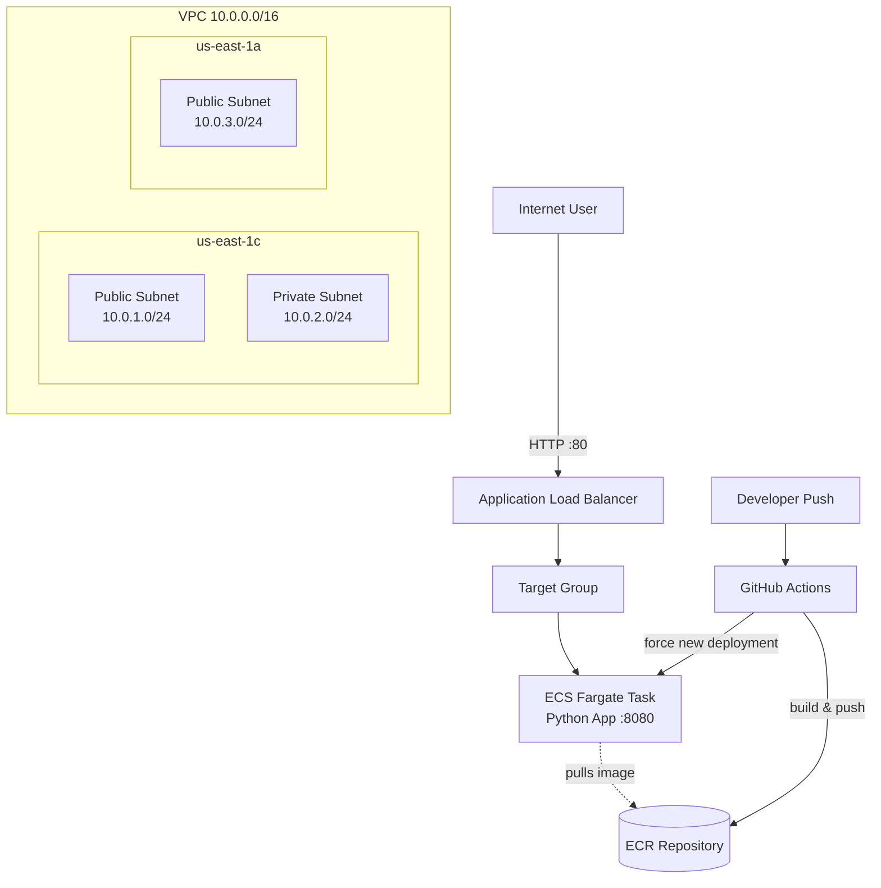

Automated AWS deployment pipeline using Terraform, Docker, and GitHub Actions.
Build as part of AWS CloudOps Certificatification prep
===

## Architecture

## Design Decisions

- **ECS Fargate over EC2**: chose Fargate to avoid managing and patching EC2 instances directly — AWS handles the underlying compute, which fits a small single-container app better than running a full Auto Scaling Group for one task.
- **Two public subnets across separate AZs**: the ALB requires multi-AZ subnets for its own resiliency guarantee, and it also means the app would survive a single Availability Zone outage.
- **Least-privilege IAM throughout**: the ECS task execution role can only pull images and write logs; the GitHub Actions IAM user can only push to ECR and update the ECS service. Neither can touch the VPC, billing, or any other AWS resource.
- **Separate security groups for the ALB and ECS tasks**: only the ALB is exposed to the internet (port 80); the ECS tasks only accept traffic from the ALB's security group specifically, not from the open internet directly.
- **Infrastructure as Code end-to-end**: every resource is defined in Terraform, meaning the entire stack can be destroyed and rebuilt identically in minutes — used in practice to avoid ongoing AWS costs between study sessions.

## What I'd Improve With More Time

- Move the ECS tasks into the **private subnet**, with the ALB as the only internet-facing component (would require a NAT Gateway for outbound internet access, e.g. pulling the image from ECR)
- Add **HTTPS** via an ACM certificate and a Route 53 domain, instead of plain HTTP
- Use **Terraform remote state** (S3 backend + DynamoDB lock table) instead of local state, so it's safe for team collaboration
- Add **auto-scaling** on the ECS service based on CPU/memory or request count
- Add automated **tests** in the GitHub Actions pipeline before the deploy step